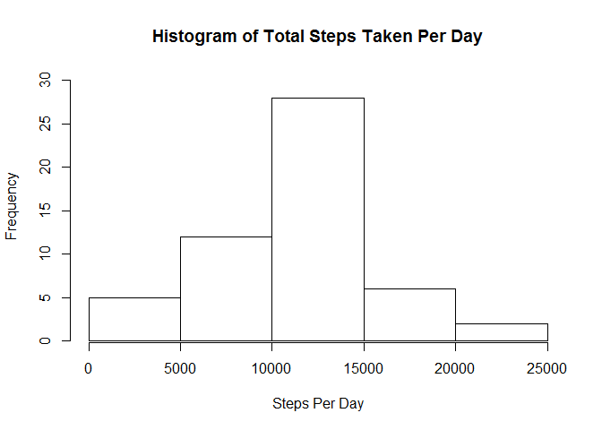
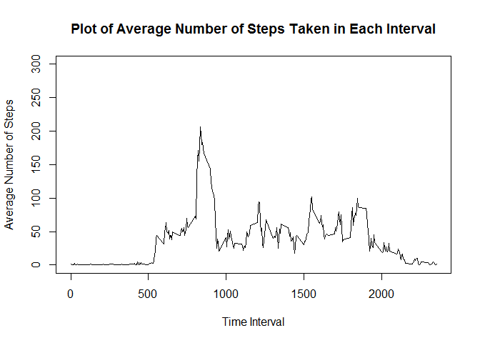
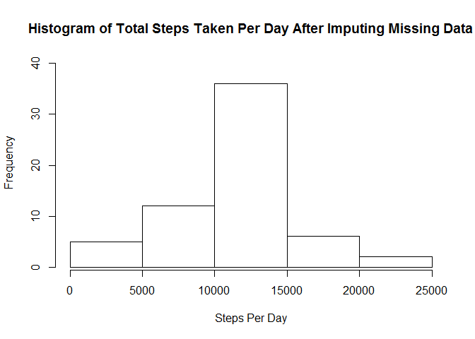

# Reproducible Research: Peer Assessment 1
       

## Loading and preprocessing the data


```r
activity<- read.table(file =  "activity.csv",header = TRUE,sep = ",",colClasses = c("integer","character","integer"))
                      
activityNoNa<-activity[complete.cases(activity),]
```

## What is mean total number of steps taken per day?


```r
require(plyr)

# Calculate total number of steps taken each day
activityDayAgg<-ddply(.data = activityNoNa[,c(1,2)],.variables = "date",.fun = summarize,steps=sum(steps) )

# calculate the Overall Daily Mean
TotalStepsDayMean<-format(round(mean(activityDayAgg$steps,0),5),5)

# Calculate the Overall daily Median
TotalStepsDayMedian<-median(activityDayAgg$steps)
  
# Plot the Histogram of Total Steps Taken Per Day
hist(x = activityDayAgg$steps,main="Histogram of Total Steps Taken Per Day",xlab = "Steps Per Day",ylab = "Frequency",ylim = c(1,30),)
```

 

#### Mean of the total number of steps taken per day is 10766.19.
#### Median pf the total number of steps taken per day is 10765

# What is the average daily activity pattern?


```r
# Calculate the Mean of steps taken for each interval
activityIntervalAgg<-ddply(.data = activityNoNa[,c(1,3)],.variables = "interval",.fun = summarize,steps=mean(steps) )

# Get the Interval for which Maximum steps are taken on an average across all days
MaxStepsInterval<-activityIntervalAgg[activityIntervalAgg$steps==max(activityIntervalAgg$steps),]$interval

#plot the graph containing average number of steps taken in each interval
plot(x = activityIntervalAgg$interval,y = activityIntervalAgg$steps,type = "l",xlab = "Time Interval" ,ylab = "Average Number of Steps",main = "Plot of Average Number of Steps Taken in Each Interval",ylim = c(0,300))
```

 

#### 835 Interval Time contains the maximum number of steps on an average across all days


# Imputing missing values


```r
# Total Number of Missing Rows

NaRows<-nrow(activity[!complete.cases(activity),])

# Fill the missing values of the original dataframe with the corresponding 5 minute Interval mean taken across all days (Already calculated above in the dataframe activityIntervalAgg)

# Initialize ImputeActivity Dataset
ImputeActivity<-activity
 
#  Loop through the activity Interval Meam dataset and replace the NAs in the original dataset with those values

for(i in seq_len(nrow(activityIntervalAgg)))

{
  
ImputeActivity[(!complete.cases(activity)) & ImputeActivity$interval==activityIntervalAgg$interval[i] ,]$steps<-activityIntervalAgg$steps[i]
}

# Calculate total number of steps taken each day
ImputedactivityDayAgg<-ddply(.data = ImputeActivity[,c(1,2)],.variables = "date",.fun = summarize,steps=sum(steps) )

# Calculate the Mean of steps taken for each day in the Imputed Dataset

ImputedTotalStepsDayMean<-format(round(mean(ImputedactivityDayAgg$steps,0),5),5)

# Calculate the Median of steps taken for each day in the Imputed Dataset

ImputedTotalStepsDayMedian<-format(round(median(ImputedactivityDayAgg$steps,0),5),5)

# Assign the Mean Impact Message to a variable

if (ImputedTotalStepsDayMean > TotalStepsDayMean) {
  MeanImpact<-"The Mean has increased after imputing missing data"
  }

if (ImputedTotalStepsDayMean == TotalStepsDayMean) {
  MeanImpact<-"The Mean hasn't changed after imputing missing data"
  }

if (ImputedTotalStepsDayMean < TotalStepsDayMean) {
  MeanImpact<-"The Mean has decreased after imputing missing data" 
  }

# Assign the Median Impact Message to a variable

if(ImputedTotalStepsDayMedian > TotalStepsDayMedian) {
  MedianImpact<-"The Median has increased after imputing missing data"
  }

if(ImputedTotalStepsDayMedian == TotalStepsDayMedian) {
  MedianImpact<-"The Median hasn't changed after imputing missing data" 
  }

if (ImputedTotalStepsDayMedian < TotalStepsDayMedian) {
  MedianImpact<-"The Median has decreased after imputing missing data"
  }


# Plot the Histogram of Total Steps Taken Per Day on the imputed dataset
hist(x = ImputedactivityDayAgg$steps,main="Histogram of Total Steps Taken Per Day After Imputing Missing Data",xlab = "Steps Per Day",ylab = "Frequency",ylim = c(1,40),)
```

 

#### Total Number of rows with missing values is 2304
#### The Mean of the total steps taken per day after imputing missing values is 10766.19
#### The Mean hasn't changed after imputing missing data
#### The Median of the total steps taken per day after imputing missing values is 10766.19
#### The Median has increased after imputing missing data

# Are there differences in activity patterns between weekdays and weekends?


```r
# Convert the date variable to Date class

ImputeActivity$date<-as.Date(x = ImputeActivity$date,format="%Y-%m-%d")

# Derive weekday and add it to the Imputed Dataset

ImputeActivity["weekfactor"]<-weekdays(ImputeActivity$date)

# Convert the weekday to factor variable having two levels - weekday or weekend

for (i in seq_len(nrow(ImputeActivity))){
  if (ImputeActivity$weekfactor[i]=="Saturday" | ImputeActivity$weekfactor[i] =="Sunday")
    {
      ImputeActivity$weekfactor[i]<-"weekend"
    }
  else
    {
      ImputeActivity$weekfactor[i]<-"weekday"
    }
}

## Calculate the mean of the steps taken group by weekfactor and 5 minute interval

ImputeActivityIntervalAgg<-ddply(.data = ImputeActivity[,c(1,3,4)],.variables = c("interval","weekfactor"),.fun = summarize,steps=mean(steps) )

require(lattice)
 
# Plot the pannel plot between containing a time series plot of the 5-minute interval (x-axis) and the average number of steps taken, averaged across all weekday days or weekend days (y-axis)

xyplot(x=steps ~ interval | weekfactor,data=ImputeActivityIntervalAgg,layout=c(1,2),type="l",xlab="Interval",ylab="Number of Steps")
```

 
